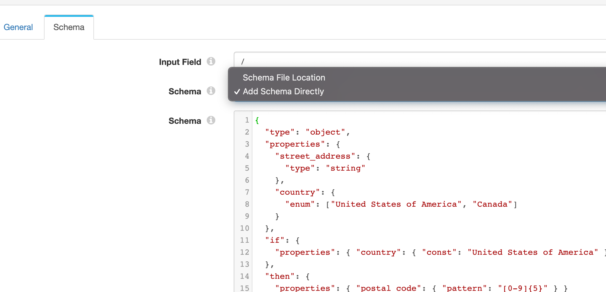

### StreamSets Schema Validator
The StreamSets Schema Validator can be used to define and enforce complex schemas using a common DSL. The processor implements https://json-schema.org  using the org.everit.json.schema implementation. 

### Installation 
For convenience I've included the tarball in the pre_packaged directory, however you can use maven to build and package for yourself. 

Copy the schema-validator-lib-xxx.tar.gz to the streamsets-datacollector-user-libs directory on your data collector and run the following commands
```
sudo tar xvfz /opt/streamsets-datacollector-user-libs/jolt-transform-lib-1.0-SNAPSHOT.tar.gz -C /opt/streamsets-datacollector-user-libs/
# restart the sdc service after extracting the tarball

```
For more details on install custom libraries please refer to the StreamSets DataCollector documentation: https://streamsets.com/documentation/datacollector/latest/help/datacollector/UserGuide/Configuration/CustomStageLibraries.html?hl=user-libs

### Usage
You can add schemas directly to the processor, or you can load them from a resource file. 


[Example Pipeline - Click Here](etc/schema-validator-example-pipeline.json)


For details on creating schemas please refer to the following documentation: 
https://json-schema.org/learn/

#### Other useful links
* Testing Schemas: https://www.jsonschemavalidator.net/
* Schema Generator: https://jsonschema.net/home
